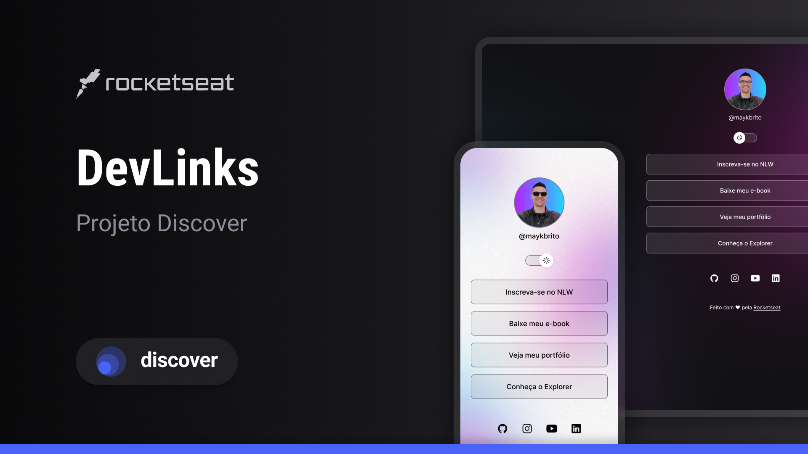

<h1 align="center"> DevLinks </h1>

Projeto exclusivo e gratuito, promovido pela Rocketseat para ensino de tecnologias WEB.

  <a href="#-tecnologias">Tecnologias</a>&nbsp;&nbsp;&nbsp;|&nbsp;&nbsp;&nbsp;
  <a href="#-projeto">Projeto</a>&nbsp;&nbsp;&nbsp;|&nbsp;&nbsp;&nbsp;
  <a href="#-layout">Layout</a>&nbsp;&nbsp;&nbsp;|&nbsp;&nbsp;&nbsp;
  <a href="#memo-licença">Licença</a>

  

 

  

## 🚀 Tecnologias

Esse projeto foi desenvolvido com as seguintes tecnologias:

- HTML e CSS
- JavaScript
- Git e Github
- Figma

## 💻 Projeto

O DevLinks é um projeto agregador de links para usar como cartão de visitas online.

## 🔖 Layout

Você pode visualizar o layout do projeto através [DESSE LINK](https://www.figma.com/community/file/1187422022288947321/devlinks-projeto-discover). É necessário ter conta no [Figma](https://figma.com) para acessá-lo.

## :memo: Licença

Esse projeto está sob a licença MIT.

---

Feito com ♥ by Rocketseat :wave: [Participe da nossa comunidade!](https://discord.gg/rocketseat)

---

### Informações adicionais ao projeto:

#### Configurando o VSCode

##### Configurando plugins utilizados

<ul>
  <li>Live Server (<i>Ritwick Dey</i>)</li>
  <li>Material Icon Theme (<i>Philipp Kief</i>)</li>
  <li>Omni Theme (<i>Rocketseat</i>)</li>
  <li>Prettier - Code formatter (<i>Prettier</i>)</li>
</ul>

### Coisas novas para aprender/relembrar

#### CSS

<ul>
  <li>box-sizing: border-box;</li>
  <li>display: flex;</li>
  <li>flex: <direction>;</li>
  <li>gap: <size>;</li>
  <li>justify-content: center;</li>
  <li>align-items: center;</li>
  <li>backdrop-filter: blur</li>
  <li>vendor prefix: -webkit-</li>
</ul>

#### GIT

<ul>
 <li>Instalar e configurar GIT</li>
 <li>Configurar Terminal no VSCode</li>
 <li>git help config</li>
 <li>configurar chave ssh:</li>
 <ul>
 <li>https://docs.github.com/pt/authentication/connecting-to-github-with-ssh/generating-a-new-ssh-key-and-adding-it-to-the-ssh-agent</li>
 <li>https://docs.github.com/pt/authentication/connecting-to-github-with-ssh/working-with-ssh-key-passphrases</li>
 <li>https://www.youtube.com/watch?v=en1dycYtL48&list=PLylCwvNCtoanYEIC4OBMO2hfB-ihCSv9Y&index=2</li>
 </ul>
</ul>
